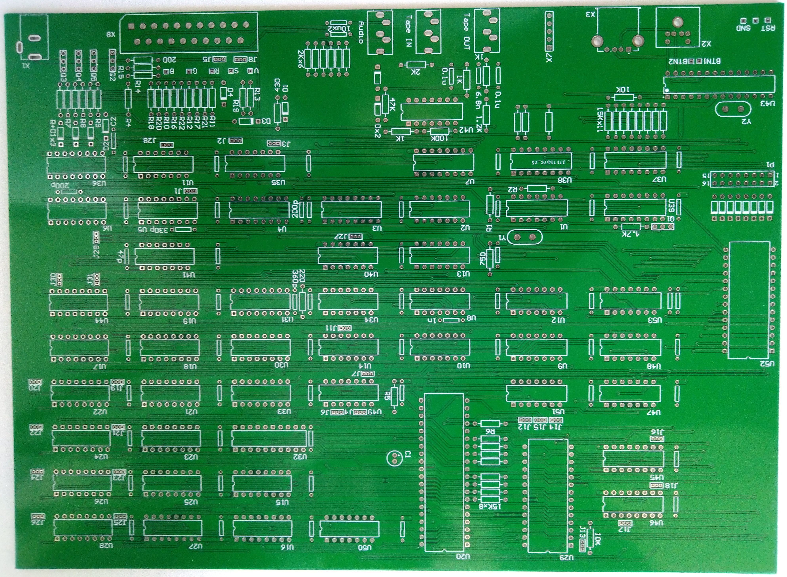
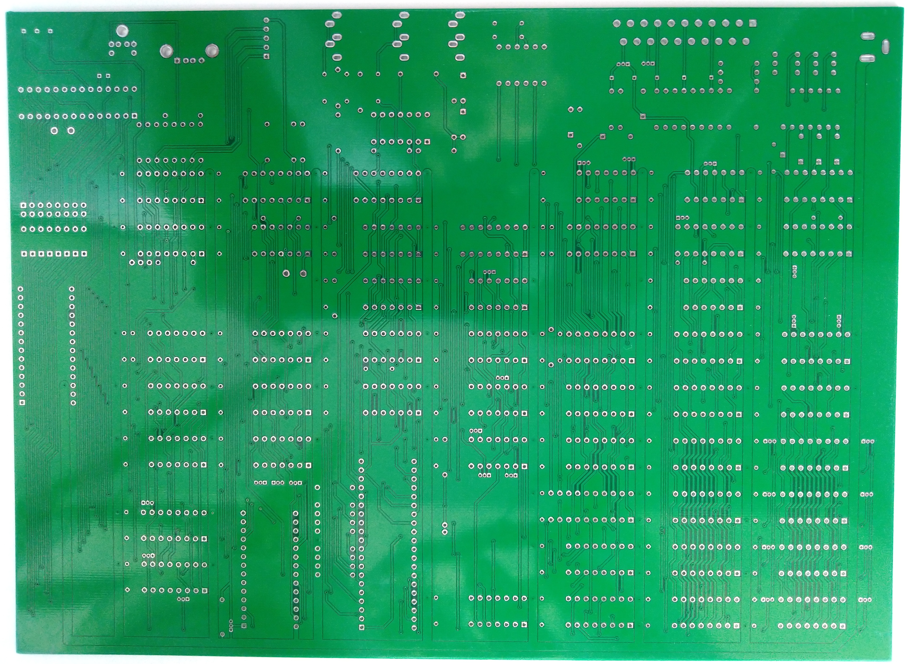
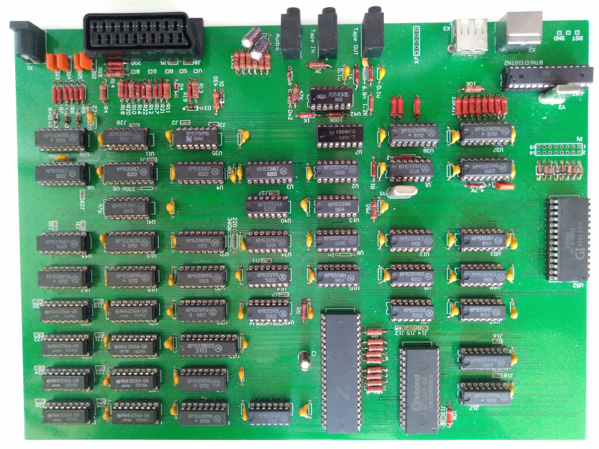

# ZX Spectrum "Leningrad" Clone  
### Educational & Configurable Hardware Platform

---

## Overview

This repository is dedicated to the legendary **ZX Spectrum "Leningrad"**, one of the most widespread Soviet clones of the original [ZX Spectrum](https://en.wikipedia.org/wiki/ZX_Spectrum).

The project contains:
- The **original schematic** of the first "Leningrad" revision  
- A **modified, configurable version** of the board designed as an educational platform  

The goal is not just preservation, but **understanding** - how the machine works, why certain issues occur, and how historical fixes evolved.

---

## 🖼️ Hardware Preview

### Bare PCB

<p align="center">
  
  
</p>

### Assembled Board

<p align="center">
  
</p>

---

## A Brief History

The original [ZX Spectrum](https://en.wikipedia.org/wiki/ZX_Spectrum) was developed in the early 1980s by [Sir Clive Sinclair](https://en.wikipedia.org/wiki/Clive_Sinclair) and his company [Sinclair Research](https://en.wikipedia.org/wiki/Sinclair_Research). It became one of the most influential home computers of its time, shaping an entire generation of developers and enthusiasts.

Due to limited availability of Western hardware in many countries — especially in the USSR and Eastern Europe — a wide ecosystem of **unofficial clones** emerged. These ranged from near-identical reproductions to heavily modified designs adapted to locally available components.

Among them, the **"Leningrad"** clone became one of the most popular due to its:
- Relative simplicity  
- Component accessibility  
- Reliability (for its time)  

This repository pays respect to the original creators, the community that kept the platform alive, and everyone who contributed improvements over the decades.

---

## Project Goals

- Preserve the **original Leningrad schematic**
- Provide a **modernized, flexible board design**
- Enable **hands-on learning** of hardware behavior
- Demonstrate **real-world faults and fixes**
- Avoid destructive modifications (no cutting traces or solder hacks)

---

## Educational Concept

The modified board introduces a **jumper-based configuration system**.

By changing jumper positions, you can:

- Recreate the **original unmodified board**
- Apply **selected historical fixes**
- Mix different modifications
- Intentionally reproduce known hardware issues

This allows you to **observe cause and effect directly**, which is extremely valuable for learning.

---

## What You Can Study

- Timing issues and signal integrity  
- Memory contention behavior  
- Video signal stability  
- Bus conflicts and decoding quirks  

All of these can be observed:
- On a **TV/display output**
- With an **oscilloscope** (recommended for deeper analysis)

---

## Repository Structure

```
leningrad-zx-spectrum/
  ├── Leningrad/
  └── Leningrad_mod/
```

Leningrad       - Original Leningrad schematic and PCB (Altium)
Leningrad_mod   - Configurable board design (Altium)

---

## Hardware Features (Modified Version)

- Jumper-selectable logic paths  
- Support for multiple known fixes  
- Non-destructive experimentation  
- Designed for repeatable testing scenarios  

---

## Example Use Cases

- Compare **original vs fixed video timing**
- Demonstrate **typical hardware faults**
- Teach **digital electronics fundamentals**
- Explore **historical engineering decisions**

---

## ⚙️ Jumper Configuration Matrix

This board uses a fully jumper-based configuration system, allowing reconstruction of multiple hardware variants of the **ZX Spectrum "Leningrad"** architecture.

---

### ⏱ System Clock (Quartz Configuration)

| Quartz MHz | J1  | J2  | J3  |
|------------|-----|-----|-----|
|    12.5    | 1-2 | 1-2 | 1-2 |
|    13.0    | 2-3 | 1-2 | 1-2 |
|    13.5    | 1-2 | 2-3 | 1-2 |
|    14.0    | 2-3 | 2-3 | 1-2 |
|    14.5    | 1-2 | 1-2 | 2-3 |
|    15.0    | 2-3 | 1-2 | 2-3 |
|    15.5    | 1-2 | 2-3 | 2-3 |
|    16.0    | 2-3 | 2-3 | 2-3 |

---

### 🧠 RAM Configuration

| Mode | J4  | J6  | J7  | J12–J26 |
|------|-----|-----|-----|---------|
| 48K  | 1-2 | 1-2 | 1-2 |   1-2   |
| 128K | 2-3 | 2-3 | 2-3 |   2-3   |
| 256K | 2-3 | 2-3 | 1-2 |   2-3   |

> Enables switching between different memory architectures without PCB modification.

---

### 🎨 Video Output Mode

|   Mode    | J5  | J8  |
|-----------|-----|-----|
|    RGB    | 1-2 | 1-2 |
| Composite | 2-3 | 2-3 |

---

### 🔧 Logic IC Configuration

|   IC Type   | J11 |
|-------------|-----|
| SN74ALS373N | 1-2 |
| SN74ALS374N | 2-3 |

---

### 📺 Video Signal Enhancements

|   Mode    | J27–J30 |
|-----------|---------|
| Leningrad |   1-2   |
|  Improve  |   2-3   |

---

### ⚡ Interrupt Handling

|   Mode    | J31 |
|-----------|-----|
| Leningrad | 1-2 |
|  Improve  | 2-3 |

---

## 🧪 Design Philosophy

This system is designed for **non-destructive hardware experimentation**:

- No trace cutting required  
- No permanent modifications  
- Full restoration of original behavior possible  

Simply change jumper positions to switch between configurations.

---

## Acknowledgements

Special thanks to:
- Sir Clive Sinclair for the original concept  
- Sinclair Research for the ZX Spectrum platform  
- The global retro computing community  
- Contributors who developed and documented hardware fixes over the years  

---

## Contributing

Contributions are welcome:
- Additional fixes  
- Measurements and oscilloscope captures  
- Documentation improvements  
- Historical research  

---

## Final Notes

This project is as much about **history** as it is about **engineering**.

It’s a way to explore how constraints, creativity, and community-driven innovation shaped one of the most iconic 8-bit ecosystems.